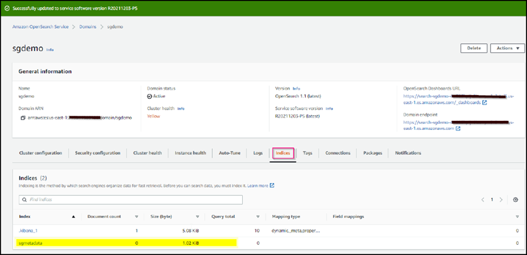
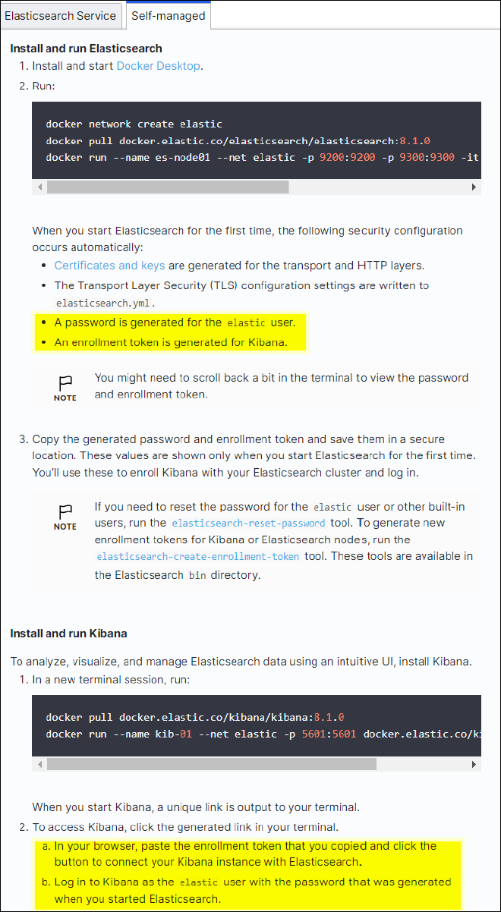
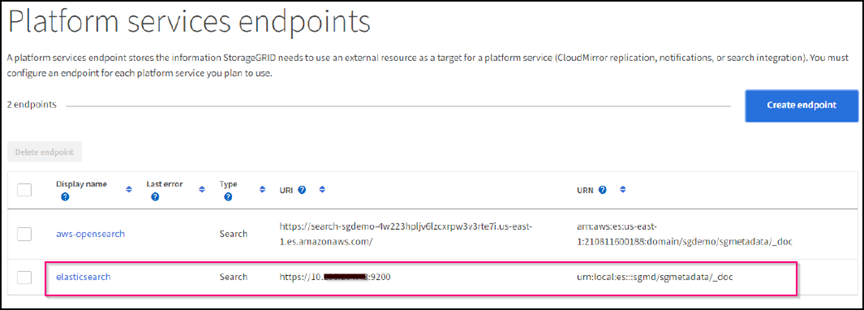

= Configure StorageGRID search integration service
:icons: font
:imagesdir: ../media/

[.lead]
This guide provides detailed instructions for configuring NetApp StorageGRID
11.6 search integration service with either Amazon OpenSearch Service or on-premises
Elasticsearch.

== Introduction
StorageGRID supports three types of platform services.

* *StorageGRID CloudMirror replication*. Mirror specific objects from a StorageGRID bucket to a specified external destination.
* *Notifications*. Per-bucket event notifications to send notifications about specific actions performed on objects to a specified external Amazon Simple Notification Service (Amazon SNS).
* *Search integration service*. Send Simple Storage Service (S3) object metadata to a specified Elasticsearch index where you can search or analyze the metadata by using the external service.

Platform services are configured by the S3 tenant through the Tenant Manager UI. For more information, see https://docs.netapp.com/us-en/storagegrid-116/tenant/considerations-for-using-platform-services.html[Considerations for using platform services^].

This document serves as a supplement to the https://docs.netapp.com/us-en/storagegrid-116/tenant/index.html[StorageGRID 11.6 Tenant Guide^] and provides step by step instructions and examples for the endpoint and bucket configuration for search integration services. The Amazon Web Services (AWS) or on-premises Elasticsearch setup instructions included here are for basic testing or demo purposes only.

Audiences should be familiar with Grid Manager, Tenant Manager, and have access to the S3 browser to perform basic upload (PUT) and download (GET) operations for StorageGRID search integration testing.

== Create tenant and enable platform services

. Create an S3 tenant by using Grid Manager, enter a display name, and select the S3 protocol.
. On the Permission page, select the Allow Platform Services option. Optionally, select other permissions, if necessary.
+

image::../media/storagegrid-search-integration-service/sg-sis-select-permissions.png[Select permissions screenshot]

. Set up the tenant root user initial password or, if identify federation is enabled on the grid, select which federated group has root access permission to configure the tenant account.

. Click Sign In As Root and select Bucket: Create and Manage Buckets.
+

This takes you to the Tenant Manager page.

. From Tenant Manager, select My Access Keys to create and download the S3 access key for later testing.

== Search integration services with Amazon OpenSearch

=== Amazon OpenSearch (formerly Elasticsearch) service setup

Use this procedure for a quick and simple setup of the OpenSearch service for testing/demo purposes only. If you are using on-premises Elasticsearch for search integration services, see the section xref:search-integration-services-with-on-premises-elasticsearch[Search integration services with on premises Elasticsearch].

NOTE: You must have a valid AWS console login, access key, secret access key, and permission to subscribe to the OpenSearch service.

. Create a new domain using the instructions from link:https://docs.aws.amazon.com/opensearch-service/latest/developerguide/gsgcreate-domain.html[AWS OpenSearch Service Getting Started^], except for the following:

* Step 4. Domain name: sgdemo
* Step 10. Fine-grained access control: deselect the Enable Fine-Grained Access Control option.
* Step 12. Access policy: select Configure Level Access Policy, select the JSON tab to modify the access policy by using the following example:
** Replace the highlighted text with your own AWS Identity and Access Management (IAM) ID and user name.
** Replace the highlighted text (the IP address) with the public IP address of your local computer that you used to access the AWS console.
** Open a browser tab to https://checkip.amazonaws.com/[https://checkip.amazonaws.com^] to find your public IP.
+

[source,json]
----
{

    "Version": "2012-10-17",    
    "Statement": [
        {
        "Effect": "Allow",
        "Principal":
        {"AWS": "arn:aws:iam:: nnnnnn:user/xyzabc"},
        "Action": "es:*",
        "Resource": "arn:aws:es:us-east-1:nnnnnn:domain/sgdemo/*"
        },
        {
        "Effect": "Allow",
        "Principal": {"AWS": "*"},
        "Action": [
        "es:ESHttp*"
                ],
        "Condition": {
            "IpAddress": {
                "aws:SourceIp": [ "nnn.nnn.nn.n/nn"
                    ]
                }
        },
        "Resource": "arn:aws:es:us-east-1:nnnnnn:domain/sgdemo/*"
        }
    ]
}
----
image::../media/storagegrid-search-integration-service/sg-sis-search-integration-amazon-opensearch.png[Search integration screenshot]

. Wait 15 to 20 minutes for the domain to become active.
+

image::../media/storagegrid-search-integration-service/sg-sis-activating-domain.png[Activating domain screenshot]

. Click OpenSearch Dashboards URL to open the domain in a new tab to access the dashboard. If you get an access denied error, verify that the access policy source IP address is correctly set to your computer public IP to allow access to the domain dashboard.
. On the dashboard welcome page, select Explore On Your Own. From the menu, go to Management -> Dev Tools
. Under Dev Tools -> Console , enter `PUT <index>` where you use the index for storing StorageGRID object metadata. We use the index name 'sgmetadata' in the following example. Click the small triangle symbol to execute the PUT command. The expected result displays on the right panel as shown in the following example screenshot.
+

image::../media/storagegrid-search-integration-service/sg-sis-using-put-command-for-index.png[Using put command for index screenshot]

. Verify that the index is visible from Amazon OpenSearch UI under sgdomain > Indices.
+

== Platform services endpoint configuration

To configure the platform services endpoints, follow these steps:

. In Tenant Manager, go to STORAGE(S3) > Platform services endpoints.
. Click Create Endpoint, enter the following, and then click Continue:
+

* Display name example `aws-opensearch`
* The domain endpoint in the example screenshot under Step 2 of the preceding procedure in the URI field.
* The domain ARN used in Step 2 of the preceding procedure in the URN field and add `/<index>/_doc` to the end of ARN.
+

In this example, URN becomes `arn:aws:es:us-east-1:211234567890:domain/sgdemo /sgmedata/_doc`.
+

image::../media/storagegrid-search-integration-service/sg-sis-enter-end-points-details.png[end-points-details screenshot]

. To access the Amazon OpenSearch sgdomain, choose Access Key as the authentication type and then enter the Amazon S3 access key and secret key. To go the next page, click Continue.
+

image::../media/storagegrid-search-integration-service/sg-sis-authenticate-connections-to-endpoints.png[authenticate connections to endpoints screenshot]

. To verify the endpoint, select Use Operating System CA Certificate and Test and Create Endpoint. If verification is successful, an endpoint screen similar to the following figure displays. If verification fails, verify that the URN includes `/<index>/_doc` at the end of the path and the AWS access key and secret key are correct.
+

image::../media/storagegrid-search-integration-service/sg-sis-platform-service-endpoints.png[platform service endpoints screenshot]

== Search integration services with on premises Elasticsearch
=== On premises Elasticsearch setup

This procedure is for a quick setup of on premises Elasticsearch and Kibana using docker for testing purposes only. If the Elasticsearch and Kibana server already exists, go to Step 5.

. Follow this link:https://docs.docker.com/engine/install/[Docker installation procedure^] to install docker. We use the link:https://docs.docker.com/engine/install/centos/[CentOS Docker install procedure^] in this setup.
+
--
 sudo yum install -y yum-utils
 sudo yum-config-manager --add-repo https://download.docker.com/linux/centos/docker-ce.repo
 sudo yum install docker-ce docker-ce-cli containerd.io
 sudo systemctl start docker
--

* To start docker after reboot, enter the following:
+
--
 sudo systemctl enable docker
--
* Set the `vm.max_map_count` value to 262144:
+
--
 sysctl -w vm.max_map_count=262144
--
* To keep the setting after reboot, enter the following:
+
--
 echo 'vm.max_map_count=262144' >> /etc/sysctl.conf
--

. Follow the link:https://www.elastic.co/guide/en/elasticsearch/reference/current/getting-started.html[Elasticsearch Quick start guide^] self-managed section to install and run the Elasticsearch and Kibana docker. In this example, we installed version 8.1.
+

TIP: Note down the user name/password and token created by Elasticsearch, you need these to start the Kibana UI and StorageGRID platform endpoint authentication.
+

+

. After the Kibana docker container has started, the URL link `\https://0.0.0.0:5601` displays in the console. Replace 0.0.0.0 with the server IP address in the URL.

. Log in to the Kibana UI by using user name `elastic` and the password generated by Elastic in the preceding step.
. For first time login, on the dashboard welcome page, select Explore On Your Own. From the menu, select Management > Dev Tools.
. On the Dev Tools Console screen, enter `PUT <index>` where you use this index for storing StorageGRID object metadata. We use the index name `sgmetadata` in this example. Click the small triangle symbol to execute the PUT command. The expected result displays on the right panel as shown in the following example screenshot.
+

image::../media/storagegrid-search-integration-service/sg-sis-execute-put-command.png[Execute put command screenshot]

== Platform services endpoint configuration

To configure endpoints for platform services, follow these steps:

. On Tenant Manager, go to STORAGE(S3) > Platform services endpoints
. Click Create Endpoint, enter the following, and then click Continue:
* Display name example: `elasticsearch`
* URI: `\https://<elasticsearch-server-ip or hostname>:9200`
* URN: `urn:<something>:es:::<some-unique-text>/<index-name>/_doc` where the index-name is the name you used on the Kibana console.
Example: `urn:local:es:::sgmd/sgmetadata/_doc`
+
image::../media/storagegrid-search-integration-service/sg-sis-platform-service-endpoint-details.png[Platform service endpoint details screenshot]

. Select Basic HTTP as the authentication type, enter the user name `elastic` and the password generated by the Elasticsearch installation process. To go to the next page, click Continue.
+

image::../media/storagegrid-search-integration-service/sg-sis-platform-service-endpoint-authentication-type.png[Platform service endpoint authentication screenshot]

. Select Do Not Verify Certificate and Test and Create Endpoint to verify the endpoint. If verification is successful, an endpoint screen similar to the following screenshot displays. If the verification fails, verify the URN, URI, and username/password entries are correct.
+

== Bucket search integration service configuration

After the platform service endpoint is created, the next step is to configure this service at bucket level to send object metadata to the defined endpoint whenever an object is created, deleted, or its metadata or tags are updated.

You can configure search integration by using Tenant Manager to apply a custom 
StorageGRID configuration XML to a bucket as follows:

. In Tenant Manager, go to STORAGE(S3) > Buckets
. Click Create Bucket, enter the bucket name (for example, `sgmetadata-test`) and accept the default `us-east-1` region.
. Click Continue > Create Bucket.
. To bring up the bucket Overview page, click the bucket name, then select Platform Services.
. Select the Enable Search Integration dialog box. In the provided XML box, enter the configuration XML using this syntax.
+

The highlighted URN must match the platform services endpoint that you defined. You can open another browser tab to access the Tenant Manager and copy the URN from the defined platform services endpoint.
+

In this example, we used no prefix, meaning that the metadata for every object in this bucket is sent to the Elasticsearch endpoint defined previously.
+

----
<MetadataNotificationConfiguration>
    <Rule>
        <ID>Rule-1</ID>
        <Status>Enabled</Status>
        <Prefix></Prefix>
        <Destination>
            <Urn> urn:local:es:::sgmd/sgmetadata/_doc</Urn>
        </Destination>
    </Rule>
</MetadataNotificationConfiguration>
----

. Use S3 Browser to connect to StorageGRID with the tenant access/secret key, upload test objects to `sgmetadata-test` bucket and add tags or custom metadata to objects.
+

image::../media/storagegrid-search-integration-service/sg-sis-upload-test-objects.png[Upload test objects screenshot]
+

. Use the Kibana UI to verify that the object metadata was loaded to sgmetadata’s index.
.. From the menu, select Management > Dev Tools.
.. Paste the sample query to the console panel on the left and click the triangle symbol to execute it.
+

The query 1 sample result in the following example screenshot shows four records. This matches number of objects in the bucket.
+

----
GET sgmetadata/_search
{
    "query": {
        "match_all": { }
}
}
----
+

image::../media/storagegrid-search-integration-service/sg-sis-query1-sample-result.png[Query 1 sample result screenshot]
+

The query 2 sample result in the following screenshot shows two records with tag type jpg.
+

----
GET sgmetadata/_search
{
    "query": {
        "match": {
            "tags.type": {
                "query" : "jpg" }
                }
            }
}
----
+

image::../media/storagegrid-search-integration-service/sg-sis-query-two-sample.png[Query 2 sample]

== Where to find additional information
To learn more about the information that is described in this document, review the following documents and/or websites:

* https://docs.netapp.com/us-en/storagegrid-116/tenant/what-platform-services-are.html[What are platform services^]
* https://docs.netapp.com/us-en/storagegrid-116/index.html[StorageGRID 11.6 Documentation^]

_By Angela Cheng_
