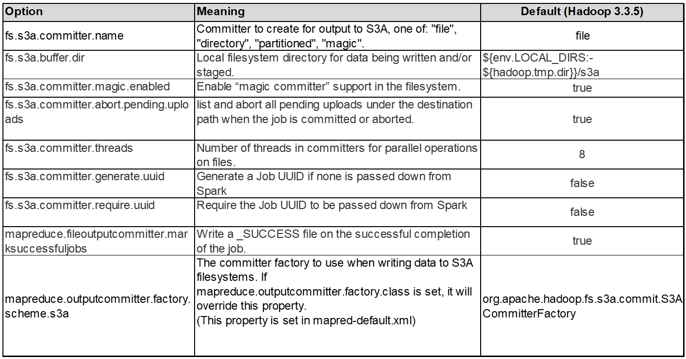

= Hadoop S3A tuning

Hadoop S3A connector facilitates seamless interaction between Hadoop-based applications and S3 object storage. Tuning the Hadoop S3A Connector is essential to optimize performance when working with S3 object storage. Before we go into tuning details, let’s have a basic understanding of Hadoop and its components.

== What is Hadoop?

*Hadoop* is a powerful open-source framework designed to handle large-scale data processing and storage. It enables distributed storage and parallel processing across clusters of computers.

The three core components of Hadoop are:

* *Hadoop HDFS (Hadoop Distributed File System)*: This handles storage, breaking data into blocks and distributing them across nodes.
* *Hadoop MapReduce*: Responsible for processing data by dividing tasks into smaller chunks and executing them in parallel.
* *Hadoop YARN (Yet Another Resource Negotiator):* https://www.simplilearn.com/tutorials/hadoop-tutorial/what-is-hadoop[Manages resources and schedules tasks efficiently]

== Hadoop HDFS and S3A connector

HDFS is a vital component of the Hadoop ecosystem, playing a critical role in efficient big data processing. HDFS enables reliable storage and management. It ensures parallel processing and optimized data storage, resulting in faster data access and analysis.

In big data processing, HDFS excels at providing fault-tolerant storage for large datasets. It achieves this through data replication. It can store and manage large volumes of structured and unstructured data in a data warehouse environment. Moreover, it seamlessly integrates with leading big data processing frameworks, such as Apache Spark, Hive, Pig, and Flink, enabling scalable and efficient data processing. It is compatible with Unix-based (Linux) operating systems, making it an ideal choice for organizations that prefer using Linux-based environments for their big data processing.

As the volume of data has grown over time, the approach of adding new machines to the Hadoop cluster with their own compute and storage has become inefficient. Scaling linearly creates challenges for using resources efficiently and managing the infrastructure.

To address these challenges, the Hadoop S3A connector offers high-performance I/O against S3 object storage. Implementing a Hadoop workflow with S3A helps you leverage object storage as a data repository and enables you to separate compute and storage, which in turn enables you to scale compute and storage independently. Decoupling compute and storage also enable you to dedicate the right amount of resources for your compute jobs and provide capacity based on the size of your data set. Therefore, you can reduce your overall TCO for Hadoop workflows.

== Hadoop S3A connector tuning

S3 behaves differently from HDFS, and some attempts to preserve the appearance of a file system are aggressively suboptimal. Careful tuning/testing/experimenting is necessary to make the most efficient use of S3 resources.

Hadoop options in this document are based on Hadoop 3.3.5, refer to https://hadoop.apache.org/docs/r3.3.5/hadoop-project-dist/hadoop-common/core-default.xml[Hadoop 3.3.5 core-site.xml] for all available options.

Note – the default value of some Hadoop fs.s3a settings are different in each Hadoop version. Be sure to check out the default value specific to your current Hadoop version. If these settings are not specified in Hadoop core-site.xml, default value will be used. You can override the value at run time using Spark or Hive configuration options.

You must go to this https://netapp.sharepoint.com/sites/StorageGRIDTME/Shared%20Documents/General/Partners/Dremio/SG%20data%20lake%20TR/Apache%20Hadoop%20Amazon%20Web%20Services%20support%20–%20Maximizing%20Performance%20when%20working%20with%20the%20S3A%20Connector[Apache Hadoop page] to understand each fs.s3a options. If possible, test them in non-production Hadoop cluster to find the optimal values.

You should read https://hadoop.apache.org/docs/stable/hadoop-aws/tools/hadoop-aws/performance.html[Maximizing Performance when working with the S3A Connector] for other tuning recommendations.

Let’s explore some key considerations:

*1. Data compression*

Do not enable StorageGRID compression. Most of big data systems use byte range get instead of retrieving the entire object. Using byte range get with compressed objects degrade the GET performance significantly.

*2. S3A committers*

In general, magic s3a committer is recommended. Refer to this https://hadoop.apache.org/docs/current/hadoop-aws/tools/hadoop-aws/committers.html#Common_S3A_Committer_Options[common S3A committer options page] to get a better understanding of magic committer and its related s3a settings.

Magic Committer:

The Magic Committer specifically relies on S3Guard to offer consistent directory listings on the S3 object store.

With consistent S3 (which is now the case), the Magic Committer can be safely used with any S3 bucket.

Choice and Experimentation:

Depending on your use case, you can choose between the Staging Committer (which relies on a cluster HDFS filesystem) and the Magic Committer.

Experiment with both to determine which best suits your workload and requirements.

In summary, the S3A Committers provide a solution to the fundamental challenge of consistent, high-performance, and reliable output commitment to S3. Their internal design ensures efficient data transfer while maintaining data integrity.

*3. Thread, connection pool sizes and block size*

* Each *S3A* client interacting with a single bucket has its own dedicated pool of open HTTP 1.1 connections and threads for upload and copy operations.
* https://hadoop.apache.org/docs/stable/hadoop-aws/tools/hadoop-aws/performance.html[You can tune these pool sizes to strike a balance between performance and memory/thread usage].
* When uploading data to S3, it is divided into blocks. The default block size is 32 MB. You can customize this value by setting the fs.s3a.block.size property.
* Larger block sizes can improve performance for large data uploads by reducing the overhead of managing multipart parts during upload. Recommended value is 256 MB or above for large data set.

image:../media/s3a-tuning/image2.png[S3A Options Table]

*4. Multipart upload*

s3a committers *always* use MPU (multipart upload) to upload data to s3 bucket. This is needed to allow for: task failure, speculative execution of tasks, and job aborts before commit. Here are some key specifications related to multipart uploads:

* Maximum object size: 5 TiB (terabytes).
* Maximum number of parts per upload: 10,000.
* Part numbers: Ranging from 1 to 10,000 (inclusive).
* Part size: Between 5 MiB and 5 GiB. Notably, there is no minimum size limit for the last part of your multipart upload.

Using a smaller part size for S3 multipart uploads has both advantages and disadvantages.

*Advantages*:

* Quick Recovery from Network Issues: When you upload smaller parts, the impact of restarting a failed upload due to a network error is minimized. If a part fails, you only need to re-upload that specific part rather than the entire object.
* Better Parallelization: More parts can be uploaded in parallel, taking advantage of multi-threading or concurrent connections. This parallelization enhances performance, especially when dealing with large files.

*Disadvantage*:

* Network overhead: Smaller part size means more parts to upload, each part requires its own HTTP request. More HTTP requests increase overhead of initiating and completing individual requests. Managing a large number of small parts can impact performance.
* Complexity: Managing the order, tracking parts, and ensuring successful uploads can be cumbersome. If the upload needs aborted, all the parts that already uploaded need to be tracked and purged.

For Hadoop, 256MB or above part size is recommended for fs.s3a.multipart.size. Always set the fs.s3a.mutlipart.threshold value to 2 x fs.s3a.multipart.size value. For example if fs.s3a.multipart.size = 256M, fs.s3a.mutlipart.threshold should be 512M.

Use larger part size for large data set. It is important to choose a part size that balances these factors based on your specific use case and network conditions.

A multipart upload is a https://docs.aws.amazon.com/AmazonS3/latest/dev/mpuoverview.html?trk=el_a134p000006vpP2AAI&trkCampaign=AWSInsights_Website_Docs_AmazonS3-dev-mpuoverview&sc_channel=el&sc_campaign=AWSInsights_Blog_discovering-and-deleting-incomplete-multipart-uploads-to-lower-&sc_outcome=Product_Marketing[three-step process]:

. The upload is initiated, StorageGRID returns an upload-id.
. The object parts are uploaded using the upload-id.
. Once all the object parts are uploaded, sends complete multipart upload request with upload-id. StorageGRID constructs the object from the uploaded parts, and client can access the object.

If the complete multipart upload request isn’t sent successfully, the parts stay in StorageGRID and will not create any object. This happens when jobs are interrupted, failed, or aborted. The parts remain in the Grid until multipart upload completes or is aborted or StorageGRID purges these parts if 15 days elapsed since upload was initiated. If there are many (few hundreds thousand to millions) in-progress multipart uploads in a bucket, when Hadoop sends ‘list-multipart-uploads’ (this request does not filter by upload id), the request may take a long time to complete or eventually time out. You may consider set fs.s3a.mutlipart.purge to true with an appropriate fs.s3a.multipart.purge.age value (e.g. 5 to 7 days, do not use default value of 86400 i.e. 1 day). Or engage NetApp support to investigate the situation.

image:../media/s3a-tuning/image3.png[S3A Options Table]

*5. Buffer write data in memory*

To enhance performance, you can buffer write data in memory before uploading it to S3. This can reduce the number of small writes and improve efficiency.

image:../media/s3a-tuning/image4.png[S3A Options Table]

Remember that S3 and HDFS work in distinct ways. Careful tuning/test/experiment is necessary to make the most efficient use of S3 resources.
