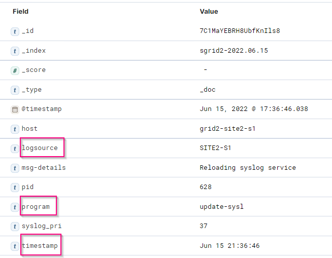
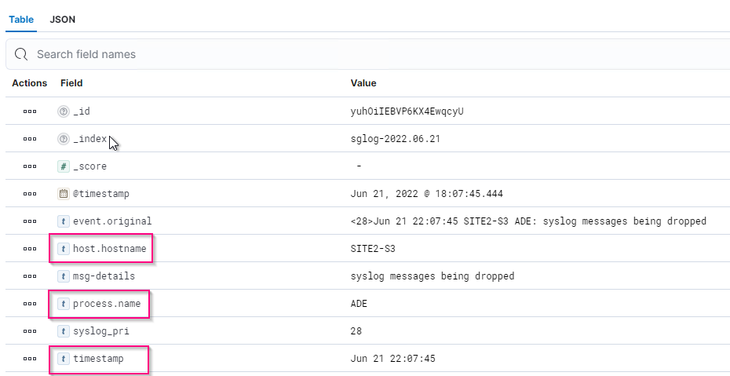

= StorageGRID log analytics using ELK stack

:icons: font
:imagesdir: ../media/
_Angela Cheng_

[.lead]
With the StorageGRID 11.6 syslog forward feature, you can configure an external syslog server to collect and analyze StorageGRID log messages.  ELK (Elasticsearch, Logstash, Kibana) has become one of the most popular log analytics solutions.  Watch the https://www.netapp.tv/details/29396[StorageGRID log analysis using ELK video] to view a sample ELK configuration and how it can be used to identify and troubleshoot failed S3 requests.  
This article provides sample files of Logstash configuration, Kibana queries, charts and dashboard to give you a quick start for StorageGRID log management and analytics.

== Requirements

* StorageGRID 11.6.0.2 or higher
* ELK (Elasticsearch, Logstash and Kibana) 7.1x or higher installed and in operation

== Sample files

* link:../media/elk-config/elk7-sample.zip[Download the Logstash 7.x sample files package] +
   *md5 checksum* 148c23d0021d9a4bb4a6c0287464deab +
   *sha256 checksum* f51ec9e2e3f842d5a7861566b167a561beb4373038b4e7bb3c8be3d522adf2d6   

* link:../media/elk-config/elk8-sample.zip[Download the Logstash 8.x sample files package] +
    *md5 checksum* e11bae3a662f87c310ef363d0fe06835 +
    *sha256 checksum* 5c670755742cfdfd5aa723a596ba087e0153a65bcaef3934afdb682f61cd278d   

== Assumption

Readers are familiar with StorageGRID and ELK terminology and operations. 

== Instruction

Two sample versions are provided due to differences in names defined by grok patterns. +
For example, the SYSLOGBASE grok pattern in Logstash config file defines field names differently depending on the installed Logstash version. 

----
match => {"message" => '<%{POSINT:syslog_pri}>%{SYSLOGBASE} %{GREEDYDATA:msg-details}'}
----

*Logstash 7.17 sample*

*Logstash 8.23 sample*

*Steps*

. Unzip the provided sample based on your installed ELK version. +
The sample folder includes two Logstash config samples: +
*sglog-2-file.conf:* this config file outputs StorageGRID log messages to a file on Logstash without data transformation.  You can use this to confirm Logstash is receiveing StorageGRID messages or to help understand StorageGRID log patterns. +
*sglog-2-es.conf:* this config file transforms StorageGRID log messages using various pattern and filters.  It includes example drop statements, which drop messages based on patterns or filter. The output is sent to Elasticsearch for indexing. +
Customize the selected config file according to the instruction inside the file.

. Test the customized config file:
+
----
/usr/share/logstash/bin/logstash --config.test_and_exit -f <config-file-path/file>
----
If the last line returned is similar to the below line, the config file has no syntax errors:
+
---- 
[LogStash::Runner] runner - Using config.test_and_exit mode. Config Validation Result: OK. Exiting Logstash
----

. Copy the customized conf file to the Logstash server's config: /etc/logstash/conf.d +
If you have not enabled config.reload.automatic in /etc/logstash/logstash.yml, restart the Logstash service.  Otherwise, wait for the config reload interval to elapse. 
+
----
 grep reload /etc/logstash/logstash.yml
# Periodically check if the configuration has changed and reload the pipeline
config.reload.automatic: true
config.reload.interval: 5s
----

. Check /var/log/logstash/logstash-plain.log and confirm there are no errors starting Logstash with the new config file.

. Confirm TCP port is started and listening.  +
In this example, TCP port 5000 is used. 
+
---- 
netstat -ntpa | grep 5000
tcp6       0      0 :::5000                 :::*                    LISTEN      25744/java
----

. From the StorageGRID manager GUI, configure external syslog server to send log messages to Logstash.  Refer to the https://www.netapp.tv/details/29396[demo video] for details. 

. You need to configure or disable firewall on the Logstash server to allow StorageGRID nodes connection to the defined TCP port.

. From Kibana GUI, select Management -> Dev Tools. On the Console page, run this GET command to confirm new indices are created on Elasticsearch.
+
----
GET /_cat/indices/*?v=true&s=index
----

. From Kibana GUI, create index pattern (ELK 7.x) or data view (ELK 8.x).

. From Kibana GUI, enter 'saved objects' in the search box which is located in the top center. +
On the Saved Objects page, select Import. Under Import options, select 'Request action on conflict'  
+
image::../media/elk-config/kibana-import-options.png[Kibana Import options]
+
Import elk<version>-query-chart-sample.ndjson. +
When prompted to resolve the conflict, select the index pattern or data view you created in step 8.
+
image::../media/elk-config/kibana-import-conflict.png[Kibana Conflict]
+
The following Kibana objects are imported: + 
*Query* +
* audit-msg-s3rq-orlm +
* bycast log s3 related messages +
* loglevel warning or above +
* failed security event +
*Chart* +
* s3 requests count based on bycast.log +
* HTTP status code +
* audit msg breakdown by type +
* average s3 response time +
*Dashboard* +
* S3 request dashboard using the above charts.

You are now ready to perform StorageGRID log analysis using Kibana. 

== Additional resources
* https://coralogix.com/blog/syslog-101-everything-you-need-to-know-to-get-started/[syslog101]
* https://www.elastic.co/what-is/elk-stack[What is the ELK stack]
* https://github.com/hpcugent/logstash-patterns/blob/master/files/grok-patterns[Grok patterns list]
* https://logz.io/blog/logstash-grok/[A beginner's guide to Logstash: Grok]
* https://coralogix.com/blog/a-practical-guide-to-logstash-syslog-deep-dive/[A practical guide to Logstash: syslog deep dive]
* https://www.elastic.co/guide/en/kibana/master/document-explorer.html[Kibana guide – Explore the document]
* https://docs.netapp.com/us-en/storagegrid-116/audit/index.html[StorageGRID audit log messages reference]
