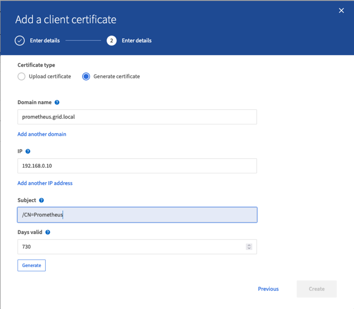

= Use Prometheus and Grafana to extend your metrics retention

:icons: font
:imagesdir: ../media/

[.lead]
This technical report provides detailed instructions for configuring NetApp StorageGRID 11.6 with external Prometheus and Grafana services.

== Introduction
StorageGRID stores metrics using Prometheus and provides visualizations of these metrics through built in Grafana dashboards. The Prometheus metrics can be accessed securely from StorageGRID by configuring client access certificates and enabling prometheus access for the specified client. Today, the retention of this metric data is limited by the storage capacity of the administration node. To gain a longer duration and an ability to create customized visualizations of these metrics we will deploy a new Prometheus and Grafana server, configure our new server to scrape the metrics from StorageGRIDs instance, and build a dashboard with the metrics that are important to us.  You can get more information on the Prometheus metrics collected in the https://docs.netapp.com/us-en/storagegrid-116/monitor/commonly-used-prometheus-metrics.html[StorageGRID documentation^].

== Federate Prometheus

=== Lab details
For the purposes of this example, I will be using all virtual machines for StorageGRID 11.6 nodes, and a Debian 11 server. The StorageGRID management interface is configured with a publicly trusted CA certificate. This example will not go through the installation and configuration of the StorageGRID system or Debian linux installation. You can use any Linux flavor you wish that is supported by Prometheus and Grafana. Both Prometheus and Grafana can install as docker containers, build from source, or pre-compiled binaries. In this example I will be installing both Prometheus and Grafana binaries directly on the same Debian server. Download and follow the basic installation instructions from HTTPS://prometheus.io and HTTPS://graphana.com respectively. 

=== Configure StorageGRID for Prometheus Client access
In order to gain access to StorageGRIDs stored prometheus metrics you must generate or upload a client certificate with private key, and enable permission for the client. The StorageGRID managament interface must have an SSL certificate. This certificate must be trusted by the prometheus server either by a trusted CA, or manually trusted if it is self-signed. To read more, please visit the https://docs.netapp.com/us-en/storagegrid-116/admin/configuring-administrator-client-certificates.html[StorageGRID documentation].

. In the StorageGRID management interface, select "CONFIGURATION" on the bottom left hand side, and in the second column under "Security" click on Certificates.
. On the Certificates page select the "Client" tab and click on the "Add" button.
. Provide a name for the client that will be granted access and use this certificate. Click on the box under "Permissions", in front of "Allow Prometheus" and click the Continue button.
+
image::../media/prometheus/cert_name.png[certificate name]
. If you have a CA signed certificate you can select the radio button for "Upload certificate", but in our case we are going to let storageGRID generate the client certificate by selecting the radio button for "Generate Certificate". The required fields will be displayed to be filled in.  Enter the FQDN for the client server, the IP of the server, the subject, and duration of the certificate.  Then click the "Generate" button.  
+

. Download the certificate pem file, and the private key pem file.
+
image::../media/prometheus/cert_download.png[certificate download]

=== Prepare the Linux server for Prometheus installation
Before installing Prometheus, I want to get my environment prepared with a Prometheus user, the directory structure, and configure the capacity for the metrics storage location.

. Create the Prometheus user.
+
[source,console]
----
sudo useradd -M -r -s /bin/false Prometheus
----
. Create the directories for Prometheus, client certificate, and metrics data.
+
[source,console]
----
sudo mkdir /etc/Prometheus /etc/Prometheus/cert /var/lib/Prometheus
----
. I formatted the disk I am using for metrics retention with an ext4 filesystem.
+
----
mkfs -t ext4 /dev/sdb
----
. I then mounted the filesystem to the Prometheus metrics directory.
+
----
sudo mount -t auto /dev/sdb /var/lib/prometheus/
----
. Obtain the uuid of the disk you are using for your metrics data.
+
----
sudo ls -al /dev/disk/by-uuid/
   lrwxrwxrwx 1 root root   9 Aug 18 17:02 9af2c5a3-bfc2-4ec1-85d9-ebab850bb4a1 -> ../../sdb 
----
. Adding an entry in /etc/fstab/ making the mount persist across reboots using the uuid of /dev/sdb. 
+
----
/etc/fstab
UUID=9af2c5a3-bfc2-4ec1-85d9-ebab850bb4a1 /var/lib/prometheus	ext4	defaults	0	0
----

=== Install and configure Prometheus
Now that the server is ready, I can begin the Prometheus installation and configure the service.

. Extract the Prometheus installation package
+ 
[source,console]
----
tar xzf prometheus-2.38.0.linux-amd64.tar.gz
----
. Copy the binaries to /usr/local/bin and change the ownership to the prometheus user created earlier
+
[source,console]
----
sudo cp prometheus-2.38.0.linux-amd64/{prometheus,promtool} /usr/local/bin
sudo chown prometheus:prometheus /usr/local/bin/{prometheus,promtool}
----
. Copy the consoles and libraries to /etc/prometheus
+
[source,console]
----
sudo cp -r prometheus-2.38.0.linux-amd64/{consoles,console_libraries} /etc/prometheus/
----
. Copy the client certificate and private key pem files downloaded earlier from StorageGRID to /etc/prometheus/certs
. Create the prometheus configuration yaml file
+
[source,console]
----
sudo nano /etc/prometheus/prometheus.yml
----
. Insert the following configuration. The job name can be anything you wish. Change the "-targets: ['']" to the FQDN of the admin node, and if you altered the names of the certificate and private key file names, please update the tls_config section to match. then save the file. If your grid management interface, is using a self-signed certificate, download the certificate and place it with the client certificate with a unique name, and in the tls_config section add ca_file: /etc/prometheus/cert/UIcert.pem
+
[source,yaml]
----
# my global config
global:
  scrape_interval: 60s # Set the scrape interval to every 15 seconds. Default is every 1 minute.

scrape_configs:
  - job_name: 'StorageGRID'
    honor_labels: true
    scheme: https
    metrics_path: /federate
    scrape_interval: 60s
    scrape_timeout: 30s
    tls_config:
      cert_file: /etc/prometheus/cert/certificate.pem
      key_file: /etc/prometheus/cert/private_key.pem
    params:
      match[]:
        - '{__name__=~"alertmanager_.*|cassandra_.*|node_.*|storagegrid_.*"}'
    static_configs:
    - targets: ['sgdemo-rtp.netapp.com:9091']
----
[NOTE]
====
NOTE: If your grid management interface is using a self-signed certificate, download the certificate and place it with the client certificate with a unique name. In the tls_config section add the certificate above the client certificate and private key lines 
....
        ca_file: /etc/prometheus/cert/UIcert.pem
....
====
. Change the ownership of all files and directories in /etc/prometheus, and /var/lib/prometheus to the prometheus user
+
[source,console]
----
sudo chown -R prometheus:prometheus /etc/prometheus/
sudo chown -R prometheus:prometheus /var/lib/prometheus/
----
. Create a prometheus service file in /etc/systemd/system
+
[source,console]
----
sudo nano /etc/systemd/system/prometheus.service
----
. Insert the following lines, note the #--storage.tsdb.retention.time=1y# which sets the retention of the metric data to 1 year. Alternatively, you could use #--storage.tsdb.retention.size=300GiB# to base retention on storage limits. This is the only location to set the metrics retention.
+
[source,console]
----
[Unit]
Description=Prometheus Time Series Collection and Processing Server
Wants=network-online.target
After=network-online.target

[Service]
User=prometheus
Group=prometheus
Type=simple
ExecStart=/usr/local/bin/prometheus \
        --config.file /etc/prometheus/prometheus.yml \
        --storage.tsdb.path /var/lib/prometheus/ \
        --storage.tsdb.retention.time=1y \
        --web.console.templates=/etc/prometheus/consoles \
        --web.console.libraries=/etc/prometheus/console_libraries

[Install]
WantedBy=multi-user.target
----
. Reload the systemd service to register the new prometheus service. then start and enable the prometheus service.
+
[source,console]
----
sudo systemctl daemon-reload
sudo systemctl start prometheus
sudo systemctl enable prometheus
----
. Check the service is runing properly
+
[source,console]
----
sudo systemctl status prometheus
----
+
----
● prometheus.service - Prometheus Time Series Collection and Processing Server
     Loaded: loaded (/etc/systemd/system/prometheus.service; enabled; vendor preset: enabled)
     Active: active (running) since Mon 2022-08-22 15:14:24 EDT; 2s ago
   Main PID: 6498 (prometheus)
      Tasks: 13 (limit: 28818)
     Memory: 107.7M
        CPU: 1.143s
     CGroup: /system.slice/prometheus.service
             └─6498 /usr/local/bin/prometheus --config.file /etc/prometheus/prometheus.yml --storage.tsdb.path /var/lib/prometheus/ --web.console.templates=/etc/prometheus/consoles --web.con>

Aug 22 15:14:24 aj-deb-prom01 prometheus[6498]: ts=2022-08-22T19:14:24.510Z caller=head.go:544 level=info component=tsdb msg="Replaying WAL, this may take a while"
Aug 22 15:14:24 aj-deb-prom01 prometheus[6498]: ts=2022-08-22T19:14:24.816Z caller=head.go:615 level=info component=tsdb msg="WAL segment loaded" segment=0 maxSegment=1
Aug 22 15:14:24 aj-deb-prom01 prometheus[6498]: ts=2022-08-22T19:14:24.816Z caller=head.go:615 level=info component=tsdb msg="WAL segment loaded" segment=1 maxSegment=1
Aug 22 15:14:24 aj-deb-prom01 prometheus[6498]: ts=2022-08-22T19:14:24.816Z caller=head.go:621 level=info component=tsdb msg="WAL replay completed" checkpoint_replay_duration=55.57µs wal_rep>
Aug 22 15:14:24 aj-deb-prom01 prometheus[6498]: ts=2022-08-22T19:14:24.831Z caller=main.go:997 level=info fs_type=EXT4_SUPER_MAGIC
Aug 22 15:14:24 aj-deb-prom01 prometheus[6498]: ts=2022-08-22T19:14:24.831Z caller=main.go:1000 level=info msg="TSDB started"
Aug 22 15:14:24 aj-deb-prom01 prometheus[6498]: ts=2022-08-22T19:14:24.831Z caller=main.go:1181 level=info msg="Loading configuration file" filename=/etc/prometheus/prometheus.yml
Aug 22 15:14:24 aj-deb-prom01 prometheus[6498]: ts=2022-08-22T19:14:24.832Z caller=main.go:1218 level=info msg="Completed loading of configuration file" filename=/etc/prometheus/prometheus.y>
Aug 22 15:14:24 aj-deb-prom01 prometheus[6498]: ts=2022-08-22T19:14:24.832Z caller=main.go:961 level=info msg="Server is ready to receive web requests."
Aug 22 15:14:24 aj-deb-prom01 prometheus[6498]: ts=2022-08-22T19:14:24.832Z caller=manager.go:941 level=info component="rule manager" msg="Starting rule manager..."
----
. You should now be able to browse to the UI of your prometheus server http://Prometheus-server:9090 and see the UI
+
image::../media/prometheus/prometheus_ui.png[prometheus UI page]
. Under "Status" Targets you can see the status of the StorageGRID endpoint we configured in prometheus.yml
+

+
image::../media/prometheus/prometheus_target_status.png[prometheus targets page]
. On the Graph page, you can execute a test query and verify the data is successfully being scraped. for example enter "storagegrid_node_cpu_utilization_percentage" into the query bar and click the Execute button.
+image::../media/prometheus/prometheus_execute.png[prometheus query execute]

== Install and configure Grafana
Now that prometheus is installed and working, we can move on to installing Grafana and configuring a dashboard

=== Grafana Instalation
.  Install the latest enterprise edition of Grafana
+
[source,console]
----
sudo apt-get install -y apt-transport-https
sudo apt-get install -y software-properties-common wget
sudo wget -q -O /usr/share/keyrings/grafana.key https://packages.grafana.com/gpg.key
----
. Add this repository for stable releases:
+
[source,console]
----
echo "deb [signed-by=/usr/share/keyrings/grafana.key] https://packages.grafana.com/enterprise/deb stable main" | sudo tee -a /etc/apt/sources.list.d/grafana.list
----

. After you add the repository.
+
[source,console]
----
sudo apt-get update
sudo apt-get install grafana-enterprise
----
. Reload the systemd service to register the new grafana service. then start and enable the Grafana service.
+
[source,console]
----
sudo systemctl daemon-reload
sudo systemctl start grafana-server
sudo systemctl enable grafana-server.service
----
. Grafana is now installed and running.  When you open a browser to HTTP://Prometheus-server:3000 you will be greeted with the Grafana login page.
. The default login credentials are admin/admin, and you should set a new password as it prompts you to.

=== Create a Grafana dashboard for StorageGRID
With Grafana and Prometheus installed and running, now its time to connect the two by creating a data source and build a dashboard

. On the left hand pane expand "Configuration" and select "Data sources", then click on the "Add Data source" button
. Prometheus will be one of the top data sources to choose from. If it is not, then use the search bar to locate "Prometheus"
. Configure the Prometheus source by entering the URL of the prometheus instance, and the scrape interval to match the Prometheus interval.  I also disabled the alerting section as I did not configure the alert manager on prometheus.
+
image::../media/prometheus/grafana_prometheus_conf.png[grafana prometheus configuration]
. With the desired settings entered, scroll down to the bottom and click on "Save & test"
. After the configuration test is successful, click on the explore button.
.. In the explore window you can use the same metric we tested Prometheus with "storagegrid_node_cpu_utilization_percentage", and click the "Run query" button
+
image::../media/prometheus/grafana_source_explore.png[grafana prometheus metric explore]
. Now that we have the data source configured, we can create a dashboard.
.. On the left hand pane expand "Dashboards", and select "+ new Dashboard"
.. Select "Add a new panel"
.. Configure the new panel by selecting a metric, again I will use "storagegrid_node_cpu_utilization_percentage", Enter a title for the panel, expand "Options" at the bottom and for legend change to custom and enter "{{instance}}" to define the node names", and on the right pane under "Standard options" set "Unit" to "Misc/Percent(0-100)". Then click "Apply" to save the panel to the dashboard.
+
image::../media/prometheus/grafana_panel_conf.png[configure grafana panel]
. We could continue to build out our dashboard like this for each metric we want, but luckily StorageGRID already has dashboards with panels we can copy into our custom dashboards.
.. From the StorageGRID management interface left hand pane, select "Support", and at the bottom of the "Tools" column click on "Metrics".
.. Within metrics, I am going to select the "Grid" link on the top of the middle column.
+
image::../media/prometheus/storagegrid_metrics.png[StorageGRID metrics]
.. From the Grid dashboard, lets select the "Storage Used - Object Metadata" panel.  Click the little down arrow and the end of the panel title to drop down a menu.  From this menu select "Inspect" and "Panel JSON".
+
image::../media/prometheus/storagegrid_dashboard_insp.png[StorageGRID dashboard]
.. Copy out the JSON code and close the window.
+
image::../media/prometheus/storagegrid_panel_inspect.png[StorageGRID JSON]
.. In our new dashboard, click on the icon to add a new panel.
+
image::../media/prometheus/grafana_add_panel.png[grafana add panel]
.. Apply the new panel without making any changes
.. Just like with the StorageGRID panel, inspect the JSON.  Remove all JSON code and replace it with the copied code from the StorageGRID panel.
+
image::../media/prometheus/grafana_panel_inspect.png[grafana inspect panel]
.. Edit the new panel, and on the right hand side you will see a Migration message with a "Migrate" button.  Click the button and then click the "Apply" button.
+
image::../media/prometheus/grafana_panel_edit_menu.png[grafana edit panel menu]
+
image::../media/prometheus/grafana_panel_edit.png[grafana edit panel]
. Once you have all of the panels in place and configured as you like. Save the dashboard by clicking the disk icon in the upper right and give your dashboard a name.

=== Conclusion
Now we have a Prometheus server with customizable data retention and storage capacity.  With this we can continue build out our own dashboards with the metrics that are most relevant to our operations. You can get more information on the Prometheus metrics collected in the https://docs.netapp.com/us-en/storagegrid-116/monitor/commonly-used-prometheus-metrics.html[StorageGRID documentation^].
