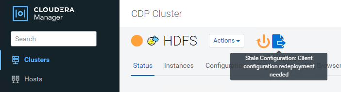

= Use Cloudera Hadoop S3A connector with StorageGRID
:icons: font
:imagesdir: ../media/

[.lead]
Hadoop has been one of data scientist's favorite platform for a long time now. Hadoop allows for distributed processing of large data sets across clusters of computers using simple programing frameworks. Hadoop was designed to scale up from single servers to thousands of machines where each machine offered its local compute and storage. 

== Why use S3A for Hadoop workflow?
As the volume of data grew overtime this approach of just adding new machines with its own compute and storage becomes inefficient. Scaling linearly has challenges in terms of using your resources efficiently and managing the infrastructure. Hadoop’s “S3A” client offers high-performance IO against S3 object storage. Implementing your Hadoop workflow via S3A helps you leverage object storage as your data repository and enables you to separate compute and storage which in turn enables organizations to scale their compute and storage independently. Decoupling compute and storage also enable organizations to dedicate the right amount of resources needed for your compute jobs and have the dedicated capacity based on how big your data set is. Hence, reducing your overall TCO on your Hadoop workflows.

== Configure S3A connector to use StorageGRID

=== Prerequisites
* You have StorageGRID S3 endpoint URL, tenant s3 access key and secret key for Hadoop S3A connection testing +
* Cloudera cluster is ready and you have root or sudo permission to each host in the cluster to install Java package.

As of April 2022, Java 11.0.14 with Cloudera 7.1.7 is tested against StorageGRID 11.5 and 11.6.  The Java version number could be different at the time of new install. 

=== Install Java package
. Verify with https://docs.cloudera.com/cdp-private-cloud-upgrade/latest/release-guide/topics/cdpdc-java-requirements.html[Cloudera support matrix^] for supported JDK version. 

. Download https://www.oracle.com/java/technologies/downloads/[Java 11.x package^] that matches the Cloudera cluster operating system.  Copy this package to each host in the cluster.  In this example, rpm package is used for CentOS. 

. Log in to each host as root or using an account with sudo permission. Perform these steps on each host: 

.. Install the package:
+
----
$ sudo rpm -Uvh jdk-11.0.14_linux-x64_bin.rpm
----
+
.. Check where Java is installed.  If multiple versions are installed, set the newly installed version as default: 
+
[subs="specialcharacters,quotes"]
----
alternatives --config java

There are 2 programs which provide 'java'.

  Selection    Command
-----------------------------------------------
 +1           /usr/java/jre1.8.0_291-amd64/bin/java
  2           /usr/java/jdk-11.0.14/bin/java

Enter to keep the current selection[+], or type selection number: 2
----
+
.. Add this line to the end of /etc/profile, the path should match the path of above selection:
+
----
export JAVA_HOME=/usr/java/jdk-11.0.14
----
+
.. Run this command for it to take effect:
+
----
source /etc/profile
----

=== Cloudera HDFS S3A configuration

.Steps

. From Cloudera Manager GUI, select Clusters > HDFS, select Configuration.
. Under CATEGORY, select Advanced, scroll down to locate 'Cluster-wide Advanced Configuration Snippet (Safety Valve) for core-site.xml 
. Click + sign and add following value pairs.
+
[cols="1a,4a" options="header"]
|===
// header row
|Name
|Value

|fs.s3a.access.key 
| _<tenant s3 access key from StorageGRID>_

|fs.s3a.secret.key 
| _<tenant s3 secret key from StorageGRID>_

|fs.s3a.connection.ssl.enabled 
|[true or false]  (default is https if this entry is missing)

|fs.s3a.endpoint 
| _<StorageGRID S3 endpoint:port>_

|fs.s3a.impl 
| org.apache.hadoop.fs.s3a.S3AFileSystem

|fs.s3a.path.style.access 
| [true or false]  (default is virtual host style if this entry is missing)

|===
+
*Sample screenshot*
+
image::../media/hadoop-s3a/hadoop-s3a-configuration.png[S3A Configuration]

. Click *Save Changes* button. Select *Stale Configuration* icon from HDFS menu bar, select 'Restart Stale Services' on next page and select 'Restart Now'.
+

== Test S3A connection to StorageGRID

=== Perform basic connection test

Login to one of the hosts in Cloudera cluster, enter

`hadoop fs -ls s3a://_<bucket-name>_/` 

The example below uses path syle with a pre-exist hdfs-test bucket and a test object.
----
[root@ce-n1 ~]# hadoop fs -ls s3a://hdfs-test/
22/02/15 18:24:37 WARN impl.MetricsConfig: Cannot locate configuration: tried hadoop-metrics2-s3a-file-system.properties,hadoop-metrics2.properties
22/02/15 18:24:37 INFO impl.MetricsSystemImpl: Scheduled Metric snapshot period at 10 second(s).
22/02/15 18:24:37 INFO impl.MetricsSystemImpl: s3a-file-system metrics system started
22/02/15 18:24:37 INFO Configuration.deprecation: No unit for fs.s3a.connection.request.timeout(0) assuming SECONDS
Found 1 items
-rw-rw-rw-   1 root root       1679 2022-02-14 16:03 s3a://hdfs-test/test
22/02/15 18:24:38 INFO impl.MetricsSystemImpl: Stopping s3a-file-system metrics system...
22/02/15 18:24:38 INFO impl.MetricsSystemImpl: s3a-file-system metrics system stopped.
22/02/15 18:24:38 INFO impl.MetricsSystemImpl: s3a-file-system metrics system shutdown complete.
----

=== Troubleshooting
*Scenario 1:* use https connection to StorageGRID and get *handshake_failure* error after 15 minutes timeout +
*Reason:* old JRE/JDK version using outdated/unsupported TLS cipher suite for connection to StorageGRID. +
Sample error message
----
[root@ce-n1 ~]# hadoop fs -ls s3a://hdfs-test/
22/02/15 18:52:34 WARN impl.MetricsConfig: Cannot locate configuration: tried hadoop-metrics2-s3a-file-system.properties,hadoop-metrics2.properties
22/02/15 18:52:34 INFO impl.MetricsSystemImpl: Scheduled Metric snapshot period at 10 second(s).
22/02/15 18:52:34 INFO impl.MetricsSystemImpl: s3a-file-system metrics system started
22/02/15 18:52:35 INFO Configuration.deprecation: No unit for fs.s3a.connection.request.timeout(0) assuming SECONDS
22/02/15 19:04:51 INFO impl.MetricsSystemImpl: Stopping s3a-file-system metrics system...
22/02/15 19:04:51 INFO impl.MetricsSystemImpl: s3a-file-system metrics system stopped.
22/02/15 19:04:51 INFO impl.MetricsSystemImpl: s3a-file-system metrics system shutdown complete.
22/02/15 19:04:51 WARN fs.FileSystem: Failed to initialize fileystem s3a://hdfs-test/: org.apache.hadoop.fs.s3a.AWSClientIOException: doesBucketExistV2 on hdfs: com.amazonaws.SdkClientException: Unable to execute HTTP request: Received fatal alert: handshake_failure: Unable to execute HTTP request: Received fatal alert: handshake_failure
ls: doesBucketExistV2 on hdfs: com.amazonaws.SdkClientException: Unable to execute HTTP request: Received fatal alert: handshake_failure: Unable to execute HTTP request: Received fatal alert: handshake_failure
----

*Resolution:* Ensure JDK 11.x or higher is installed and set to default Java library.  Refer to <<Install Java package>> section for details. 

*Scenario 2:* Failed to connect to StorageGRID with error message *'unable to find valid certification path to requested target'*. +
*Reason:* StorageGRID S3 endpoint server certificate is not trusted by Java program. +
Sample error message:
----
[root@hdp6 ~]# hadoop fs -ls s3a://hdfs-test/
22/03/11 20:58:12 WARN impl.MetricsConfig: Cannot locate configuration: tried hadoop-metrics2-s3a-file-system.properties,hadoop-metrics2.properties
22/03/11 20:58:13 INFO impl.MetricsSystemImpl: Scheduled Metric snapshot period at 10 second(s).
22/03/11 20:58:13 INFO impl.MetricsSystemImpl: s3a-file-system metrics system started
22/03/11 20:58:13 INFO Configuration.deprecation: No unit for fs.s3a.connection.request.timeout(0) assuming SECONDS
22/03/11 21:12:25 INFO impl.MetricsSystemImpl: Stopping s3a-file-system metrics system...
22/03/11 21:12:25 INFO impl.MetricsSystemImpl: s3a-file-system metrics system stopped.
22/03/11 21:12:25 INFO impl.MetricsSystemImpl: s3a-file-system metrics system shutdown complete.
22/03/11 21:12:25 WARN fs.FileSystem: Failed to initialize fileystem s3a://hdfs-test/: org.apache.hadoop.fs.s3a.AWSClientIOException: doesBucketExistV2 on hdfs: com.amazonaws.SdkClientException: Unable to execute HTTP request: PKIX path building failed: sun.security.provider.certpath.SunCertPathBuilderException: unable to find valid certification path to requested target: Unable to execute HTTP request: PKIX path building failed: sun.security.provider.certpath.SunCertPathBuilderException: unable to find valid certification path to requested target
----
*Resolution:* recommend using a server certificate issued by a known public certificate signing authority to avoid this problem and ensure the authentication is secure.  Alternatively, add the custom CA or server certificate to Java trust store. 

.Steps to add StorageGRID custom CA or server certificate to Java trust store

. Backup existing default Java cacerts file
+
----
cp -ap $JAVA_HOME/lib/security/cacerts $JAVA_HOME/lib/security/cacerts.orig
----
+
. Import StorageGRID S3 endpoint cert to Java trust store
+
[subs="specialcharacters,quotes"]
----
keytool -import -trustcacerts -keystore $JAVA_HOME/lib/security/cacerts -storepass changeit -noprompt -alias sg-lb -file _<StorageGRID CA or server cert in pem format>_
----

.Tips for troubleshooting

. Increase hadoop log level to DEBUG:
+
`export HADOOP_ROOT_LOGGER=hadoop.root.logger=DEBUG,console`

. Execute the command and direct the log messages to error.log, example:
+
`hadoop fs -ls s3a://_<bucket-name>_/ &>error.log`
